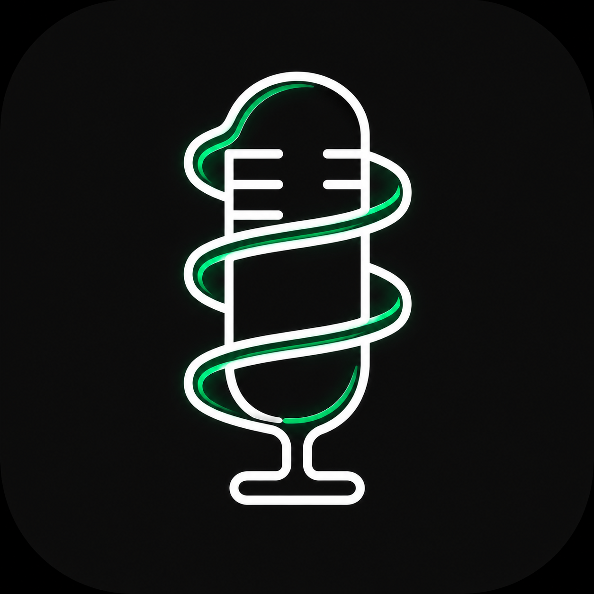

<div align="center">
  
  <h1>VoicePipe</h1>

  <p>
    <a href="https://github.com/Yamada-Ryo4/VoicePipe/releases"></a>
    <a href="https://dotnet.microsoft.com/download/dotnet/8.0"></a>
    <a href="https://github.com/Yamada-Ryo4/VoicePipe/blob/main/LICENSE"></a>
    <a href="https://github.com/Yamada-Ryo4/VoicePipe/stargazers"></a>
    
  </p>

  <p>
    <a href="README.md">中文</a> | <b>English</b>
  </p>
</div>

VoicePipe is a lightweight, high-performance audio routing and mixing utility for Windows. It allows you to isolate audio from a specific application and seamlessly mix it with your microphone input in real-time, outputting the result to a virtual audio cable (e.g., VB-Cable).

This is incredibly useful for streamers, podcasters, and gamers who want to share game audio or music through voice chat applications (like Discord, Zoom, or Teams) without transmitting system-wide sounds (like notification pings or background videos).

## ⬇️ Download & Usage

- **Direct Download**: [VoicePipeSetup.exe](https://github.com/Yamada-Ryo4/VoicePipe/releases/download/v1.2.5/VoicePipeSetup.exe) (Includes runtime and virtual audio cable driver. One-click install)
- **How to Use**:
  1. Install and open VoicePipe.
  2. Select the application you want to capture from the top dropdown (e.g., a game or music player).
  3. Select your physical microphone from the second dropdown.
  4. Click **START** to begin mixing.
  5. In your voice chat app (Discord, Zoom, Teams, etc.), set your input microphone to **CABLE Output (VB-Audio Virtual Cable)**.

## Features

- **Per-Process Audio Isolation**: Uses the Windows 10/11 WASAPI Per-Process Loopback API to capture audio from exactly one application, ignoring all other system sounds.
- **Smart Process Grouping**: Multi-process apps (Chrome, Edge, etc.) spawn many child processes. VoicePipe groups them by process name so each app shows as a single entry and resolves to its "root process". Combined with process-tree capture, audio from every tab / child process is captured — nothing missed.
- **Zero Echo**: Your captured application audio is routed directly to the virtual mic. You hear the game normally, but your audience hears the clean mix without any recursive echo. The mic list automatically filters VB-Cable loopback endpoints, with an extra guard at startup to prevent feedback howling.
- **AI Neural Noise Reduction**: Integrates the Xiph **RNNoise** neural network to remove background noise (keyboard, fan, hum) while you speak. A "Strength" slider (dry/wet mix) lets you balance between thorough denoising and preserving natural voice texture, avoiding a hollow sound. Affects the microphone only — never the app audio.
- **Local Monitoring**: Play the mix back to your headphones in real time to hear exactly what you send. Monitor the mic only, the app audio only, or the full output; the monitor output device is selectable (follows system default by default). Runs on a fully independent output chain that never affects the low-latency path to VB-Cable.
- **Global Hotkeys**: Customizable global hotkeys for "mute microphone" and "start/stop mixing" — operate without leaving your fullscreen game.
- **System Tray**: Close-to-tray background operation, with optional run-at-boot and auto-reconnect to the last audio source / microphone.
- **Smart Session Caching**: Works around Windows Per-Process Loopback API limitations by caching active loopback sessions per PID. Switching between audio sources is instant — no delays or app restarts needed.
- **Pull-Based Mixing Engine**: Built on `IWaveProvider`, the mix engine uses a pull architecture where `WaveOutEvent` drives the output clock. This eliminates stuttering and latency issues inherent in push-based models. The VB-Cable output runs at a fixed 10ms ultra-low latency.
- **End-to-End 48kHz**: The entire pipeline runs at 48kHz — matching modern microphones, the system mixer, VB-Cable, and RNNoise's native rate — eliminating redundant resampling for cleaner audio and lower latency.
- **High Fidelity**: Supports 16-bit, 24-bit, and 32-bit float microphone inputs. Automatically downmixes multi-channel inputs to stereo. Uses Catmull-Rom cubic spline resampling and tanh soft-limiting for pristine audio quality.
- **Clipping Indicator**: Level bars turn red near full scale (≥99%) to warn you to lower the gain and avoid distortion.
- **Live Diagnostics Console**: Built-in real-time diagnostic console (accessible via right-clicking anywhere on the window) to monitor audio streams, device initialization, and key state-change logs.
- **Sleek UI**: A modern, minimalist WPF interface with an animated inline settings page, dark/light themes, 5 languages (Simplified/Traditional Chinese, English, Japanese, Korean), and real-time waveform visualization. All volume, gain, denoise, and monitor settings apply instantly and are saved automatically.

## Prerequisites

- **OS**: Windows 10 Build 19041 (Version 2004) or later, or Windows 11. (Required for WASAPI Per-Process Loopback).
- **Runtime**: The installer is self-contained (includes .NET 8.0 runtime). No additional installation needed.
- **Virtual Audio Cable**: VB-Cable is required and included in the installer. VoicePipe will automatically detect and output to the "CABLE Input" device.

## Building from Source

1. Clone the repository.
2. Ensure you have the .NET 8.0 SDK installed.
3. Navigate to the `src/VoicePipe` directory.
4. Run the build command:
   ```bash
   dotnet build -c Release
   ```
5. To create a self-contained executable for distribution:
   ```bash
   dotnet publish -c Release -r win-x64 --self-contained true
   ```

## Installer Packaging

VoicePipe uses **Inno Setup** to package the application along with the VB-Cable driver into a single, user-friendly installer.

1. Install [Inno Setup 6](https://jrsoftware.org/isinfo.php).
2. Open `VoicePipe.iss` in Inno Setup.
3. Click **Compile**.
4. The compiled installer `VoicePipeSetup.exe` will be generated in the `Output` folder.

## How It Works

```
┌──────────────┐    float[]     ┌─────────────────┐    IWaveProvider.Read()    ┌──────────────────┐
│ Loopback     │ ──────────────►│                 │ ◄──────────────────────── │                  │
│ Capturer     │   FeedApp()    │  AudioMixEngine │                           │ VirtualMicWriter │ ──► CABLE Input
│ (Per-PID     │                │  (RingBuffer ×2 │   mixed float[] PCM      │ (WaveOutEvent    │     (VB-Cable)
│  Cache Pool) │                │   + Resampler   │ ─────────────────────────►│  10ms latency)   │
│              │                │   @48kHz)       │                           └──────────────────┘
└──────────────┘                │                 │   monitor float[] PCM     ┌──────────────────┐
┌──────────────┐    float[]     │                 │ ─────────────────────────►│ MonitorOutput    │ ──► Headphones
│ MicCapturer  │ ──► RNNoise ──►│                 │                           │ (independent     │     (local monitor)
│ (WASAPI)     │   FeedMic()    └─────────────────┘                           │  output chain)   │
└──────────────┘   mic-only NR                                                └──────────────────┘
```

1. **LoopbackCapturer**: Uses COM interfaces (`IAudioClient`, `ActivateAudioInterfaceAsync`) to initiate a Per-Process Loopback stream with `INCLUDE_TARGET_PROCESS_TREE`, capturing the target process and its entire child-process tree (covering browser tabs / audio-service children). All activated sessions are cached by PID in `PipelineManager`, enabling instant switching without re-activation failures.
2. **ProcessEnumerator**: Uses a Toolhelp snapshot of parent/child relationships to group same-named multi-process apps into a single "root process" entry in the list.
3. **MicCapturer**: Captures microphone input using NAudio's `WasapiCapture` and normalizes the PCM data to 32-bit IEEE Float format, handling 16/24/32-bit depths.
4. **RnnoiseDenoiser**: Real-time denoising based on the Xiph RNNoise neural network, applied to the mic path only (48kHz mono — native rate, no resampling). A dry/wet mix balances denoising against voice naturalness. Pure passthrough when disabled; never touches app audio.
5. **AudioMixEngine**: Implements `IWaveProvider`, driven by `WaveOutEvent`'s device clock (pull model). Reads both capture streams via thread-safe RingBuffers, runs at 48kHz, uses Catmull-Rom cubic spline resampling and tanh soft-limiting, and produces the local-monitor signal plus UI waveform data in the same loop.
6. **VirtualMicWriter**: Receives the mixed 32-bit float PCM data and writes it to the VB-Cable "CABLE Input" endpoint using WASAPI shared mode (10ms ultra-low latency).
7. **MonitorOutput**: A local-monitor output chain independent of VB-Cable. Pulls from the engine's separate monitor buffer and plays back to the user-selected device (system default by default). Fully isolated — never affects the VB-Cable low-latency path.
8. **PipelineManager**: Pipeline coordinator. Maintains a `Dictionary<int, LoopbackCapturer>` cache pool. Uses closure-based PID checking to ensure only the active source's data feeds into the mixer. `StopAsync` preserves loopback sessions for instant resume.

## License

This project is licensed under the [GNU AGPL v3.0](LICENSE). See the LICENSE file for details.
Note that the included VB-Cable driver installer (`deps/vbcable_extracted`) is subject to VB-Audio's licensing terms.
